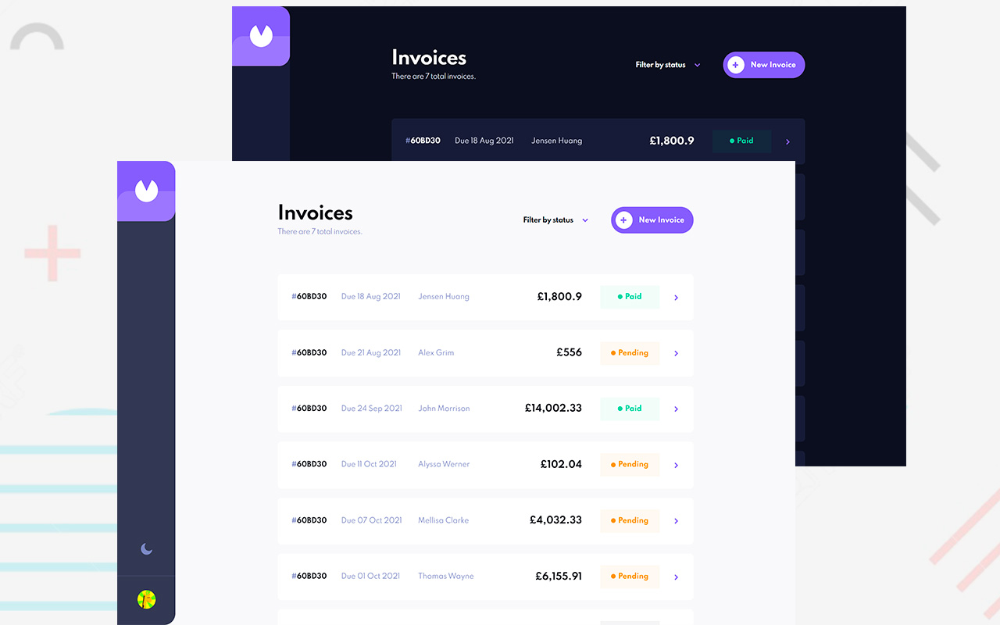

# Invoice App

An invoice app based on a frontend mentor challenge. It contains a CRUD based on a backend with Nestjs and a database with MongoDB. You can see a live demo at this [link](https://davidbarcenas.github.io/angular-invoice/).

### Preview  

### Features

- Create, read, update, and delete invoices
- Toggle light and dark mode
- Filter invoices by status (draft/pending/paid)
- Form validation and component animations
- Use an API made with Nestjs
- Maintains data persistence

### Running the app

Clone/download the project and run `npm install` to build the dependencies the project needs.

#### Development

Run `ng serve` for a dev server. Navigate to `http://localhost:4200/`. The app will automatically reload if you change any of the source files.

#### Build

Run `ng build` to build the project. The build artifacts will be stored in the `dist/` directory. Use the `--prod` flag for a production build.

### Notes

When you start the project make sure you have the backend running that is in the following [link.](https://github.com/DavidBarcenas/nestjs-invoice-api)

### License

Released under the [MIT licensed](LICENSE)